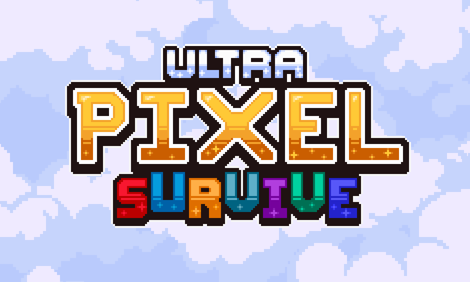

# 🎮 Naka Gamedev — Jogos feitos por um jogador!

Seja bem-vindo à página oficial do desenvolvedor **Naka**!

Aqui você encontra informações sobre meus jogos e projetos em andamento.

---

## 🕹️ Sobre o jogo: Ultra Pixel Survive

**Ultra Pixel Survive** é um jogo que mistura RPG de ação e sobrevivência em um mundo retrô com arte em pixel. Desenvolvido pela GS Studios, o jogo desafia os jogadores a sobreviver o máximo de tempo possível em um ambiente hostil e cheio de perigos.

Você controla heróis com habilidades únicas, coleta recursos naturais como madeira, pedra e minérios, constrói defesas para proteger sua vila e enfrenta ondas de inimigos a cada noite. Além disso, é possível explorar masmorras subterrâneas, caçar, cozinhar e desbloquear novos personagens.

### ✨ Principais recursos:

- 🏠 Construção e evolução de base  
- 🛡️ Defesa da vila com torres e armadilhas  
- 🌾 Agricultura, caça e culinária  
- 🔓 Sistema de progressão com heróis únicos  
- 🐲 Batalhas contra chefes em um mundo de fantasia épica  
- 🧩 Estilo visual em pixel art nostálgico  

Se você curte jogos indie com desafio e personalidade, **Ultra Pixel Survive** é feito pra você.
